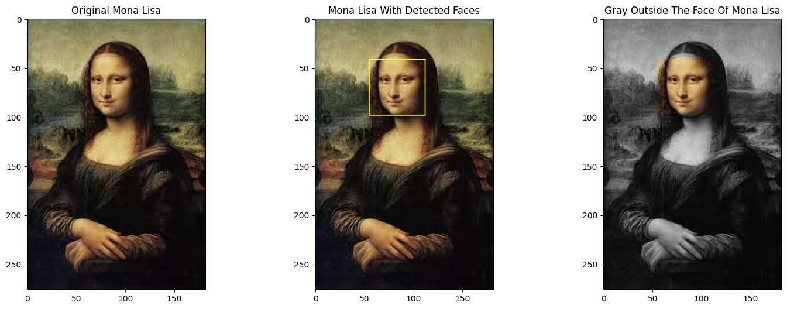

# Pre-course Assignment

# Google Colab (https://colab.research.google.com/drive/15L0csA7TX1A6NpHrblPYa3P5veKyKAMp#scrollTo=gB53IPYylFlH&uniqifier=4)

# Installation
1) Clone the repository (git clone https://github.com/MohammadSatel/Assignment_Google.git)
2) Go to folder path (cd Assignment_Google)
3) Create virtual enviroment (py -m venv .venv)
4) Activate virtual enviroment (.venv\Scripts\activate)
5) Install required packages (pip install -r requirements.txt)
6) Start the app (py app.py)

# 3 subplots figure

